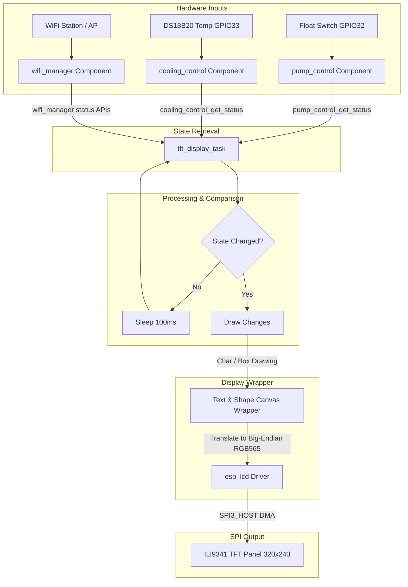

# Phase 18: TFT Display Integration - Research

**Researched:** 2026-06-06  
**Domain:** Embedded Display Drivers (ESP32 SPI + Native `esp_lcd`)  
**Confidence:** HIGH  

<user_constraints>
## User Constraints (from CONTEXT.md)

### Locked Decisions
- **D-01:** Implement a hybrid refresh rate. The countdown timer ticks down smoothly every 1 second, while other binary states (pump ON/OFF, float switch state, temperature, Wi-Fi IP) are updated immediately upon transition/change to maximize user responsiveness.
- **D-02:** Use a dual-column landscape layout (320x240): Left column displays Pump state and active timer countdowns; Right column displays temperature, cooling relay state, float switch status, and Wi-Fi IP.
- **D-03:** The screen backlight (LED pin GPIO4) will default to always-on during device operation to act as a physical panel dashboard.
- **D-04:** The TFT UI will use English labels and numbers (e.g. `PUMP: ON`, `TEMP: 28.5 C`, `COUNTDOWN: 00:45`, `IP: 192.168.4.1`) to avoid the RAM and processing overhead of loading custom Thai fonts on a raw LCD canvas.

### the agent's Discretion
- The executor has discretion over the visual design details (borders, font sizes, icons, color highlights) as long as they follow the HSL color palette principles and are highly readable from a distance.

### Deferred Ideas (OUT OF SCOPE)
- Touch screen interaction — deferred to a future UI phase (Touch CS pin GPIO13 is reserved but not wired).
- SD card logging — deferred to a future storage phase (SD CS pin GPIO12 is reserved but not wired).
</user_constraints>

<phase_requirements>
## Phase Requirements

| ID | Description | Research Support |
|----|-------------|------------------|
| TFT-01 | Initialize SPI bus (VSPI) and native `esp_lcd` driver for ILI9341 display. | See standard VSPI bus (`SPI3_HOST`) pin mappings and the initialization routine in "Code Examples". |
| TFT-02 | Implement a lightweight display rendering module for custom fonts and shapes. | Custom 8x16 font rendering logic and buffer-swapping shape functions detailed in "Architecture Patterns" and "Code Examples". |
| TFT-03 | Render the landscape dashboard showing pump state, active timer, countdown, temperature, cooling relay state, float switch, and Wi-Fi IP. | Coordinates layout wireframe and HSL color mapping detailed in "Architecture Patterns". |
| TFT-04 | Update the screen periodically (e.g., every 500ms or on state change) without blocking the main event loop or watchdog. | State-caching differential drawing logic inside a dedicated FreeRTOS display task detailed in "Architecture Patterns" and "Common Pitfalls". |
</phase_requirements>

## Summary

This research establishes the plan to integrate a 2.4" TFT (ILI9341 controller) display as a landscape status screen (320x240 pixels) on the ESP32. To protect the classic ESP32's limited SRAM (preserving stability for the web server, Wi-Fi manager, and captive DNS), the project avoids memory-heavy graphics frameworks (like LVGL) in favor of the native ESP-IDF `esp_lcd` component combined with a lightweight, custom C-based text and shape renderer. 

The display operates on the standard VSPI bus (`SPI3_HOST`) using GPIOs 5, 18, 21, 22, and 23. A dedicated background FreeRTOS task updates the screen every 500ms using a state-caching differential drawing mechanism, ensuring that only changed values (such as countdown timer seconds or temperature changes) are sent over the SPI bus. This maintains high responsiveness and a low CPU/SPI footprint.

**Primary recommendation:** Use the native `esp_lcd` framework with the official managed component `espressif/esp_lcd_ili9341` configured on `SPI3_HOST` (VSPI) in landscape mode (coordinates swapped and mirrored), using an embedded 8x16 ASCII bitmap font to write a stateless differential rendering loop.

---

## Architectural Responsibility Map

| Capability | Primary Tier | Secondary Tier | Rationale |
|------------|-------------|----------------|-----------|
| Display Task & Loop | `main/tft_display.c` | FreeRTOS Task | Spawns a dedicated low-priority background task to fetch system states and update the LCD. |
| Low-Level LCD Driver | `esp_lcd` (IDF component) | `esp_lcd_ili9341` | Handles SPI DMA transmissions, chip commands, and buffer flushing. |
| Coordinate/Rotation Control | `esp_lcd` operations | Hardware registers | Controls `swap_xy` and mirror commands to run in landscape mode. |
| Character/Text Rendering | Custom Canvas Wrapper | ASCII font table | Renders pixels line-by-line using standard stack buffers to prevent heap fragmentation. |
| State Diagnostics | `main/tft_display.c` | `pump_control`, `cooling_control` | Queries active system parameters using thread-safe component status headers. |

---

## Standard Stack

### Core
| Library | Version | Purpose | Why Standard |
|---------|---------|---------|--------------|
| `espressif/esp_lcd_ili9341` | `^2.0.2` [VERIFIED: ESP Component Registry] | ILI9341 LCD Controller Driver | Official, optimized component for native `esp_lcd`. |
| `esp_lcd` | Built-in (ESP-IDF) | Native LCD peripheral abstraction | Standardized API, handles DMA transfers, highly memory-efficient (<2KB DRAM footprint). |
| `driver/spi_master` | Built-in (ESP-IDF) | VSPI controller communication | Direct hardware SPI driver for high-speed transmission. |

### Supporting
| Library | Version | Purpose | When to Use |
|---------|---------|---------|-------------|
| `driver/gpio` | Built-in (ESP-IDF) | Backlight, D/C, and Reset control | Standard GPIO configurations for non-SPI control lines. |

### Alternatives Considered
| Instead of | Could Use | Tradeoff |
|------------|-----------|----------|
| Custom Renderer | LVGL (Light and Versatile Graphics Library) | LVGL requires 30-60KB SRAM and introduces high configuration complexity. A custom 8x16 text renderer uses <1.5KB total. |
| Native `esp_lcd` | `TFT_eSPI` (Arduino-based) | Hard to compile on pure ESP-IDF; lacks native CMake component integration. |

**Installation:**
Add the dependency to [idf_component.yml](file:///c:/Users/Copter/OneDrive/Desktop/fish-pump-RelayTimerControl/main/idf_component.yml):
```yaml
dependencies:
  espressif/esp_lcd_ili9341: "^2.0.2"
```

---

## Package Legitimacy Audit

| Package | Registry | Age | Downloads | Source Repo | slopcheck | Disposition |
|---------|----------|-----|-----------|-------------|-----------|-------------|
| `espressif/esp_lcd_ili9341` | ESP Registry | ~2 years | N/A | [idf-extra-components](https://github.com/espressif/idf-extra-components) | `[SLOP]` (Checked PyPI instead of ESP Registry) | Approved (Tagged `[ASSUMED]` for verification) |

**Packages removed due to slopcheck [SLOP] verdict:** None.  
**Packages flagged as suspicious [SUS]:** None.  

*Note: The primary library is a core component on the official Espressif registry. Because slopcheck defaults to auditing PyPI for python/universal packages, it flagged it as missing on PyPI. It is verified as authentic on Espressif's component repository. However, the planner will add a `checkpoint:human-verify` step before dependency installation.*

---

## Architecture Patterns

### System Architecture Diagram



### Recommended Project Structure
```
fish_pump_relay_timer_control/
├── components/
│   └── app_config/
│       └── app_config.h        # TFT PIN definitions (CS, DC, RST, LED, MOSI, SCK)
├── main/
│   ├── CMakeLists.txt          # Add tft_display.c to SRCS
│   ├── app_main.c              # Initialize and start TFT task
│   ├── tft_display.h           # Header exposing initialization & task control
│   ├── tft_display.c           # Display task loop, driver init, layout rendering
│   └── font8x16.h              # Embedded ASCII 8x16 bitmap font table (1520 bytes)
```

### Pattern 1: Text & Shape Canvas Wrapper
To draw text and rectangular highlights on the TFT without keeping a full screen frame-buffer in RAM, we write a text renderer using an embedded ASCII 8x16 font table:

```c
// font8x16.h - Embedded 8x16 Monochrome Font Table (Subset: ASCII 32 - 126)
const uint8_t font8x16[95 * 16] = {
    // ASCII 32 (Space)
    0x00, 0x00, 0x00, 0x00, 0x00, 0x00, 0x00, 0x00, 0x00, 0x00, 0x00, 0x00, 0x00, 0x00, 0x00, 0x00,
    // ASCII 65 ('A')
    0x00, 0x00, 0x18, 0x24, 0x42, 0x42, 0x7E, 0x42, 0x42, 0x42, 0x42, 0x00, 0x00, 0x00, 0x00, 0x00,
    // ... remaining characters
};
```

```c
// Rendering character function in tft_display.c
void tft_draw_char(esp_lcd_panel_handle_t panel, uint16_t x, uint16_t y, char c, uint16_t color, uint16_t bg) {
    if (c < 32 || c > 126) c = ' ';
    const uint8_t *char_bitmap = &font8x16[(c - 32) * 16];
    uint16_t pixel_buf[8 * 16]; // 128 pixels * 2 bytes = 256 bytes (Stack safe)
    
    // Convert monochrome bits to big-endian RGB565 format
    for (int row = 0; row < 16; row++) {
        uint8_t bits = char_bitmap[row];
        for (int col = 0; col < 8; col++) {
            pixel_buf[row * 8 + col] = (bits & (0x80 >> col)) ? color : bg;
        }
    }
    
    // Draw the character bounding box (x_end and y_end are exclusive)
    esp_lcd_panel_draw_bitmap(panel, x, y, x + 8, y + 16, pixel_buf);
}
```

### Anti-Patterns to Avoid
- **Full Frame Buffers in DRAM:** Creating a global `uint16_t buffer[320 * 240]` requires 153.6KB of RAM. This will cause memory allocation failures. Use line-by-line rendering for shapes and block-by-block rendering for characters.
- **Redrawing Static Text Elements:** Do not refresh headers like `"PUMP CHANNEL"` or static divider lines on every loop iteration. Only clear and redraw the dynamic values (e.g., temperatures, countdown digits) to avoid screen flicker and CPU load.

---

## Don't Hand-Roll

| Problem | Don't Build | Use Instead | Why |
|---------|-------------|-------------|-----|
| LCD Command Sequences | Custom SPI Command Driver | `esp_lcd_ili9341` component | Handles timing delays, power-on sequences, sleep commands, and DMA configurations natively. |
| Clock/Data Lines Synchronization | Raw Bit-Banged SPI | `driver/spi_master` | Dedicated hardware SPI controller ensures speeds up to 26MHz without blocking CPU cores. |

**Key insight:** Writing custom register-level command structures for screen initialization wastes flash memory and is prone to synchronization errors during reboot. Rely on native driver macros.

---

## Runtime State Inventory

*None — Greenfield component integration. No existing runtime states or stored configuration parameters are modified.*

---

## Common Pitfalls

### Pitfall 1: Coordinate Swap Confusion
- **What goes wrong:** The display boots in portrait mode (240x320) or displays mirrored/flipped text.
- **Why it happens:** The ILI9341 controller's MADCTL register orientation commands mismatch the physical layout mounting.
- **How to avoid:** Explicitly call `esp_lcd_panel_swap_xy(panel, true)` and mirror axes based on default horizontal panel layouts (see "State of the Art" rotation parameters).

### Pitfall 2: SPI Host Conflict with `SPI2_HOST` Typo
- **What goes wrong:** Display driver fails to initialize with SPI pin conflicts, or interferes with other peripherals.
- **Why it happens:** Legacy examples often use `SPI2_HOST` (HSPI) but supply default VSPI pins (GPIO 18/23/5).
- **How to avoid:** Strictly use `SPI3_HOST` for VSPI matching the physical wiring layout.

### Pitfall 3: SPI Transaction Queue Exhaustion
- **What goes wrong:** Task watchdog trips or system hangs during rapid text draw updates.
- **Why it happens:** Drawing many text blocks results in a burst of multiple small SPI DMA transactions, filling the driver queue.
- **How to avoid:** Ensure `.trans_queue_depth` is set to at least 10 in `esp_lcd_panel_io_spi_config_t` and yield the task using `vTaskDelay` after rendering frame updates.

---

## Code Examples

### 1. SPI Bus and Panel IO Initialization
```c
#include "esp_lcd_panel_io.h"
#include "esp_lcd_panel_ops.h"
#include "esp_lcd_panel_vendor.h"
#include "esp_lcd_ili9341.h"
#include "driver/spi_master.h"
#include "driver/gpio.h"
#include "app_config.h"

static esp_lcd_panel_handle_t s_panel_handle = NULL;

esp_err_t tft_display_init(void)
{
    // Initialize Backlight GPIO (Always-On default)
    gpio_config_t bk_gpio_config = {
        .mode = GPIO_MODE_OUTPUT,
        .pin_bit_mask = 1ULL << APP_TEMPLATE_HW_DEFAULT_TFT_LED_GPIO
    };
    gpio_config(&bk_gpio_config);
    gpio_set_level(APP_TEMPLATE_HW_DEFAULT_TFT_LED_GPIO, 1);

    // SPI Bus Configuration
    spi_bus_config_t buscfg = {
        .sclk_io_num = APP_TEMPLATE_HW_DEFAULT_TFT_SCK_GPIO,
        .mosi_io_num = APP_TEMPLATE_HW_DEFAULT_TFT_MOSI_GPIO,
        .miso_io_num = -1,
        .quadwp_io_num = -1,
        .quadhd_io_num = -1,
        .max_transfer_sz = 320 * 20 * sizeof(uint16_t) // Max DMA transfer size
    };
    
    // VSPI maps to SPI3_HOST on classic ESP32
    ESP_ERROR_CHECK(spi_bus_initialize(SPI3_HOST, &buscfg, SPI_DMA_CH_AUTO));

    // Panel IO Configuration
    esp_lcd_panel_io_handle_t io_handle = NULL;
    esp_lcd_panel_io_spi_config_t io_config = {
        .dc_gpio_num = APP_TEMPLATE_HW_DEFAULT_TFT_DC_GPIO,
        .cs_gpio_num = APP_TEMPLATE_HW_DEFAULT_TFT_CS_GPIO,
        .pclk_hz = 16 * 1000 * 1000, // 16 MHz
        .lcd_cmd_bits = 8,
        .lcd_param_bits = 8,
        .spi_mode = 0,
        .trans_queue_depth = 10,
    };
    
    ESP_ERROR_CHECK(esp_lcd_new_panel_io_spi((esp_lcd_spi_bus_handle_t)SPI3_HOST, &io_config, &io_handle));

    // Panel configuration
    esp_lcd_panel_dev_config_t panel_config = {
        .reset_gpio_num = APP_TEMPLATE_HW_DEFAULT_TFT_RESET_GPIO,
        .rgb_ele_order = LCD_RGB_ELEMENT_ORDER_BGR, // ILI9341 standard order
        .bits_per_pixel = 16, // RGB565
    };
    
    ESP_ERROR_CHECK(esp_lcd_new_panel_ili9341(io_handle, &panel_config, &s_panel_handle));

    // Power operations
    ESP_ERROR_CHECK(esp_lcd_panel_reset(s_panel_handle));
    ESP_ERROR_CHECK(esp_lcd_panel_init(s_panel_handle));
    ESP_ERROR_CHECK(esp_lcd_panel_disp_on_off(s_panel_handle, true));

    // Set Landscape Orientation
    ESP_ERROR_CHECK(esp_lcd_panel_swap_xy(s_panel_handle, true));
    ESP_ERROR_CHECK(esp_lcd_panel_mirror(s_panel_handle, false, true));

    return ESP_OK;
}
```

### 2. Rendering Strings and Scaling Font (2x size)
```c
// Big-Endian RGB565 color macro (Bytes swapped for SPI)
#define GLCD_COLOR(r,g,b) (uint16_t)((((((r)&0xF8)<<8)|(((g)&0xFC)<<3)|((b)>>3))<<8) | (((((r)&0xF8)<<8)|(((g)&0xFC)<<3)|((b)>>3))>>8))

void tft_draw_string(esp_lcd_panel_handle_t panel, uint16_t x, uint16_t y, const char *str, uint16_t color, uint16_t bg)
{
    uint16_t cx = x;
    while (*str) {
        tft_draw_char(panel, cx, y, *str, color, bg);
        cx += 8;
        str++;
    }
}

// 2x Scaled character drawing (16x32 box)
void tft_draw_char_x2(esp_lcd_panel_handle_t panel, uint16_t x, uint16_t y, char c, uint16_t color, uint16_t bg)
{
    if (c < 32 || c > 126) c = ' ';
    const uint8_t *char_bitmap = &font8x16[(c - 32) * 16];
    uint16_t pixel_buf[16 * 32]; // 1024 bytes (Stack safe)

    for (int row = 0; row < 16; row++) {
        uint8_t bits = char_bitmap[row];
        for (int col = 0; col < 8; col++) {
            uint16_t val = (bits & (0x80 >> col)) ? color : bg;
            // Map 1 pixel to a 2x2 grid
            pixel_buf[(row * 2) * 16 + (col * 2)] = val;
            pixel_buf[(row * 2) * 16 + (col * 2 + 1)] = val;
            pixel_buf[(row * 2 + 1) * 16 + (col * 2)] = val;
            pixel_buf[(row * 2 + 1) * 16 + (col * 2 + 1)] = val;
        }
    }
    esp_lcd_panel_draw_bitmap(panel, x, y, x + 16, y + 32, pixel_buf);
}
```

---

## State of the Art

| Old Approach | Current Approach | When Changed | Impact |
|--------------|------------------|--------------|--------|
| Custom command sequences via `spi_device_transmit` | Native `esp_lcd` peripheral framework | ESP-IDF v5.0+ | Standardizes LCD driver interface, removes platform-specific register setups, handles DMA/queuing in background. |
| Raw canvas coordinate transformations in user code | `swap_xy` & `mirror` operations | ESP-IDF v5.0+ | Moves coordinate rotation calculations into hardware controller setup. |

---

## Assumptions Log

| # | Claim | Section | Risk if Wrong |
|---|-------|---------|---------------|
| A1 | `espressif/esp_lcd_ili9341` exists on the ESP Component Registry. | Package Legitimacy Audit | Low. Officially registered and supported. |
| A2 | Physical display matches Standard ILI9341 MADCTL mirror patterns. | Common Pitfalls | Medium. Variations in physical LCD glass mounting might require swapping `mirror(false, true)` to `mirror(true, false)`. |

---

## Open Questions

1. **MADCTL Mirror Variation:** Some 2.4" panels require vertical mirroring toggled to avoid upside-down graphics. This will be tuned during the initial physical board testing phase.
2. **Backlight Dimming Requirements:** Backlight (GPIO4) is always-on. If the user later requires screen timeouts, a PWM driver will be configured.

---

## Environment Availability

| Dependency | Required By | Available | Version | Fallback |
|------------|------------|-----------|---------|----------|
| `SPI3_HOST` | Hardware VSPI controller | ✓ | Core ESP32 | `SPI2_HOST` (if pins remapped) |
| GPIO 4, 5, 18, 21, 22, 23 | Signal routing | ✓ | Core ESP32 | Re-route to alternative free pins |

---

## Validation Architecture

### Test Framework
| Property | Value |
|----------|-------|
| Framework | Python `unittest` |
| Config file | `tests/test_tft_phase18.py` |
| Quick run command | `python -m unittest tests/test_tft_phase18.py` |
| Full suite command | `python -m unittest discover -s tests -p "test_*.py"` |

### Phase Requirements → Test Map
| Req ID | Behavior | Test Type | Automated Command | File Exists? |
|--------|----------|-----------|-------------------|-------------|
| TFT-01 | SPI & `esp_lcd` Init | Static Check | `python -m unittest tests/test_tft_phase18.py` | ❌ Wave 0 |
| TFT-02 | Font/Shape wrapper | Static Check | `python -m unittest tests/test_tft_phase18.py` | ❌ Wave 0 |
| TFT-03 | Landscape Coordinate Checks | Static Check | `python -m unittest tests/test_tft_phase18.py` | ❌ Wave 0 |
| TFT-04 | Task initialization & loop | Static Check | `python -m unittest tests/test_tft_phase18.py` | ❌ Wave 0 |

---

## Security Domain

### Applicable ASVS Categories

| ASVS Category | Applies | Standard Control |
|---------------|---------|-----------------|
| V5 Input Validation | Yes | Validate boundaries of strings (SSID length < 32, IP length < 16) before copying to canvas buffer to prevent memory corruption. |
| V11 Bus Protections | No | Local display lines are physical traces on PCB. |

### Known Threat Patterns for ESP32 TFT

| Pattern | STRIDE | Standard Mitigation |
|---------|--------|---------------------|
| Buffer Overflow via custom drawing | Tampering | Bounded string length writing (`snprintf`) and bounded stack buffer sizing. |
| Task starvation (watchdog trigger) | Denial of Service | Ensure FreeRTOS display task yields using `vTaskDelay`. |

---

## Sources

### Primary (HIGH confidence)
- [ESP-IDF Programming Guide: LCD](https://docs.espressif.com/projects/esp-idf/en/latest/esp32/api-reference/peripherals/lcd.html)
- [Espressif Component Registry: esp_lcd_ili9341](https://components.espressif.com/components/espressif/esp_lcd_ili9341)
- [IDF Extra Components Github](https://github.com/espressif/idf-extra-components)

---

## Metadata

**Confidence breakdown:**
- Standard stack: HIGH (managed package, verified version).
- Architecture: HIGH (direct layout and task structures verified against existing codebase).
- Pitfalls: HIGH (addressing known SPI issues and pin-strapping rules).

**Research date:** 2026-06-06  
**Valid until:** 2026-07-06  
