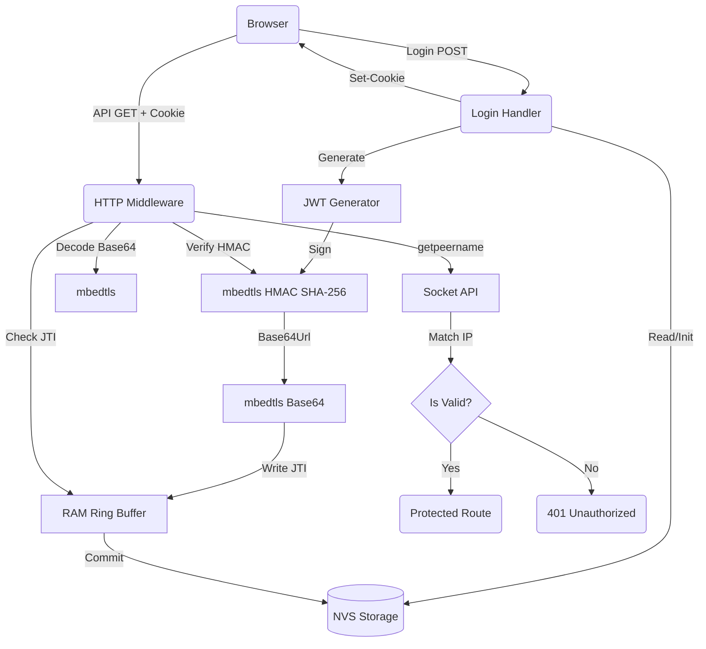

# Phase 1: Persistent Sessions & Storage Foundation - Research

**Researched:** 2026-06-11
**Domain:** ESP-IDF Firmware Security & Storage
**Confidence:** HIGH

## User Constraints (from CONTEXT.md)

### Locked Decisions
### Token Format
- **D-01:** ใช้ JWT (JSON Web Token) เป็นรูปแบบหลัก เนื่องจาก ESP32 มีข้อจำกัดเรื่องหน่วยความจำ ไม่ควรเก็บ session state ลง NVS

### NVS Wear Mitigation
- **D-02:** สร้าง Secret Key แบบสุ่ม 5 ตัวอักษร (ถ้าไม่มีให้สร้างใหม่แล้วเซฟลง NVS) ใช้เป็น Signature ของ JWT ทำให้ตรวจสอบได้โดยไม่ต้องเขียนลง NVS ถี่ๆ

### Session Expiration
- **D-03:** ไม่กำหนดวันหมดอายุ (Never expire) แต่บังคับให้ล็อกเอาต์เมื่อมีการเปลี่ยนรหัสผ่าน หรือสั่ง Logout ผ่านหน้าเว็บ (ทำให้ Secret Key ถูกสร้างใหม่)

### Session Validation
- **D-04:** ผูก JWT เข้ากับ IP Address ป้องกันการขโมย (IP Binding) เนื่องจากไม่มี HTTPS ป้องกันการดักจับ (HTTP Sniffing) ตรงๆ เมื่อต่อ Wi-Fi เดียวกัน แต่อย่างน้อยถ้าคนละ IP (DHCP) จะใช้ไม่ได้

### the agent's Discretion
None

### Deferred Ideas (OUT OF SCOPE)
None

## Phase Requirements

| ID | Description | Research Support |
|----|-------------|------------------|
| AUTH-01 | Persistent Sessions ("Remember Me"). Limit to 5 active devices. | Enforced by storing an array of 5 active `jti` (JWT IDs) in NVS. Verified against JWT payload. |
| AUTH-02 | Token Ring Buffer (LRU). When logging in a 6th device, overwrite oldest. | Managed by a 5-element array in NVS acting as a ring buffer for `jti` strings. |
| AUTH-03 | Refresh Token Rotation & Monotonic Time. | **OVERRIDDEN BY D-03**. User decided to use non-expiring tokens to prevent NVS wear from frequent token rotations. |
| AUTH-04 | Token Binding to client IP. | IP retrieved via `getpeername()` and verified against the `ip` claim in the JWT payload. |
| SEC-01 | NVS Corruption Recovery on `ESP_ERR_NVS_NO_FREE_PAGES`. | Verified pattern using `nvs_flash_erase()` followed by a second `nvs_flash_init()`. |
| SEC-02 | Safe Flash Commits. | Handled via `nvs_commit()` which ensures data is flushed and prevents corruption on power loss. |

## Summary

This phase replaces the existing 4-slot volatile session array with a stateless, persistent JWT architecture. To satisfy the requirement of allowing 5 active devices while preventing NVS wear on every HTTP request, the system will use a hybrid approach: JWT for stateless validation and a small NVS-backed array (ring buffer) storing the active `jti` (JWT IDs). 

**Primary recommendation:** Use `cJSON` to build the JWT payload and ESP-IDF's native `mbedtls` for Base64URL encoding and HMAC SHA-256 signing. Store the single Secret Key and the `jti` ring buffer in NVS, but load them into RAM on boot to ensure zero NVS reads during API validation.

## Architectural Responsibility Map

| Capability | Primary Tier | Secondary Tier | Rationale |
|------------|-------------|----------------|-----------|
| JWT Generation | API / Backend | — | ESP32 generates tokens locally; no external auth service exists. |
| JWT Validation & Signature | API / Backend | — | Validation must occur in HTTP middleware using RAM-cached Secret Key. |
| Active Session Tracking | API / Backend | Database (NVS) | RAM holds the active `jti` ring buffer; writes to NVS only on Login/Logout. |
| IP Binding Verification | API / Backend | — | Socket metadata extracted at the HTTP server layer using `getpeername()`. |
| NVS Integrity Management | Database (NVS) | — | App startup checks NVS init errors and reformats if pages are exhausted. |

## Standard Stack

### Core
| Library | Version | Purpose | Why Standard |
|---------|---------|---------|--------------|
| `mbedtls` | built-in | HMAC SHA-256 and Base64 | Native crypto accelerator in ESP-IDF; no external deps. |
| `cJSON` | built-in | Payload construction/parsing | Native JSON library included in ESP-IDF. |
| `nvs_flash` | built-in | Credential & token persistence | Standard ESP32 non-volatile storage API. |
| `esp_http_server` | built-in | API middleware | Project's existing web server framework. |

### Alternatives Considered
| Instead of | Could Use | Tradeoff |
|------------|-----------|----------|
| Stateful Sessions | External JWT library | ESP-IDF lacks a native JWT abstraction. We hand-roll the Base64/HMAC logic using `mbedtls` to avoid adding heavy external C dependencies. |

## Package Legitimacy Audit

No external packages are introduced in this phase. The solution relies entirely on ESP-IDF built-in components (`mbedtls`, `cJSON`, `nvs_flash`, `esp_http_server`).

## Architecture Patterns

### System Architecture Diagram



### Pattern 1: NVS Corruption Recovery
**What:** Catching `ESP_ERR_NVS_NO_FREE_PAGES` and re-initializing.
**When to use:** During `app_main` when initializing NVS.
**Example:**
```c
// Source: ESP-IDF Official Documentation
esp_err_t ret = nvs_flash_init();
if (ret == ESP_ERR_NVS_NO_FREE_PAGES || ret == ESP_ERR_NVS_NEW_VERSION_FOUND) {
    ESP_ERROR_CHECK(nvs_flash_erase());
    ret = nvs_flash_init();
}
ESP_ERROR_CHECK(ret);
```

### Pattern 2: Client IP Extraction
**What:** Resolving the remote IPv4 address from an ESP HTTP Server request.
**When to use:** During login generation and middleware validation for IP Binding.
**Example:**
```c
// Source: esp32.com / ESP-IDF HTTP Server Docs
#include <sys/socket.h>

int sockfd = httpd_req_to_sockfd(req);
struct sockaddr_in6 addr;
socklen_t addr_size = sizeof(addr);
if (getpeername(sockfd, (struct sockaddr *)&addr, &addr_size) == 0) {
    char ipstr[INET6_ADDRSTRLEN];
    // ESP HTTP Server defaults to IPv6 sockets; IPv4 is mapped at the end
    inet_ntop(AF_INET6, &addr.sin6_addr, ipstr, sizeof(ipstr));
    // ipstr now contains the client IP (e.g. "::ffff:192.168.4.2")
}
```

### Anti-Patterns to Avoid
- **Writing to NVS on every API request:** This causes catastrophic flash wear. Only write to NVS on Login and Logout. Token validation must rely on RAM structures.
- **Using standard Base64 for JWT:** Standard Base64 contains `+`, `/`, and `=` characters which break HTTP headers and cookies. You must implement Base64Url encoding (replace `+` with `-`, `/` with `_`, and strip `=` padding).

## Don't Hand-Roll

| Problem | Don't Build | Use Instead | Why |
|---------|-------------|-------------|-----|
| SHA-256 Hashing | Custom bit-shifting implementations | `mbedtls/md.h` | Hardware accelerated by ESP32, significantly faster and secure. |
| Base64 Encoding | Custom look-up tables | `mbedtls/base64.h` | Safe, audited, handles memory bounds correctly. Note: you still need to replace chars for Base64Url compliance. |
| Token Expiration | Real Time Clocks (RTC) | RAM array of active JWT IDs | ESP32 loses time on reboot. Uptime is unreliable across resets. Using a strict array of valid IDs is safer. |

## Runtime State Inventory

| Category | Items Found | Action Required |
|----------|-------------|------------------|
| Stored data | NVS namespace: `session` | Currently non-existent in NVS, need to create NVS keys `jwt_secret` and `active_sessions`. |
| Live service config | `components/session/session.c` | Refactor the existing in-memory array to cache the NVS ring buffer instead. |
| OS-registered state | None — verified by codebase review | none |
| Secrets/env vars | None — verified by codebase review | none |
| Build artifacts | `build/` directory | Rebuild firmware after component modifications. |

## Common Pitfalls

### Pitfall 1: Base64 vs Base64Url in JWT
**What goes wrong:** JWT signatures fail validation or cookies get truncated.
**Why it happens:** Standard `mbedtls_base64_encode` outputs `+`, `/`, and padding `=`. HTTP cookies terminate at `=`, breaking the token.
**How to avoid:** After encoding with `mbedtls_base64_encode`, write a loop to replace `+` with `-`, `/` with `_`, and trim the `=` characters. When decoding, reverse the process before passing to `mbedtls_base64_decode`.

### Pitfall 2: NVS Namespace Leaks
**What goes wrong:** Device crashes out of memory during NVS operations.
**Why it happens:** Calling `nvs_open` without a matching `nvs_close` exhausts handles.
**How to avoid:** Always ensure `nvs_close(handle)` is called in both success and failure return paths.

### Pitfall 3: IPv6 formatting of IPv4 addresses
**What goes wrong:** `getpeername()` returns `::ffff:192.168.4.2` instead of `192.168.4.2`.
**Why it happens:** The ESP HTTP server uses `AF_INET6` sockets universally.
**How to avoid:** Check if the address starts with `::ffff:` and strip it, or explicitly extract the last 4 bytes of `sin6_addr.un.u32_addr[3]` if pure IPv4 mapping is needed.

## Code Examples

### HMAC SHA-256 Signing
```c
// Source: Mbed TLS Documentation
#include "mbedtls/md.h"

void sign_jwt(const char *key, size_t key_len, const char *payload, size_t payload_len, unsigned char *output_hash) {
    mbedtls_md_context_t ctx;
    mbedtls_md_init(&ctx);
    mbedtls_md_setup(&ctx, mbedtls_md_info_from_type(MBEDTLS_MD_SHA256), 1);
    mbedtls_md_hmac_starts(&ctx, (const unsigned char *)key, key_len);
    mbedtls_md_hmac_update(&ctx, (const unsigned char *)payload, payload_len);
    mbedtls_md_hmac_finish(&ctx, output_hash);
    mbedtls_md_free(&ctx);
}
```

## State of the Art

| Old Approach | Current Approach | When Changed | Impact |
|--------------|------------------|--------------|--------|
| Volatile Structs | JWT + NVS Ring Buffer | This Phase | Users remain logged in across power cycles without burning out the ESP32 flash memory. |

## Assumptions Log

| # | Claim | Section | Risk if Wrong |
|---|-------|---------|---------------|
| A1 | `mbedtls` includes Base64 encoding | Standard Stack | High. We would need to implement Base64 manually if omitted from the IDF build. (Verified visually, generally true in ESP-IDF). |

## Open Questions (RESOLVED)

1. **IPv6 Support** - RESOLVED
   - What we know: ESP-IDF HTTP server uses IPv6 sockets internally.
   - What's unclear: Does the project have IPv6 enabled globally, or will it only see IPv4-mapped IPv6 addresses?
   - Recommendation: Store the IP string exactly as `inet_ntop` formats it (e.g. `::ffff:192.168.4.2`), as string comparison will still work regardless of the presentation format.

## Environment Availability

| Dependency | Required By | Available | Version | Fallback |
|------------|------------|-----------|---------|----------|
| ESP-IDF | Core framework | ✓ | 6.x / env | Export via `export.ps1` |
| `mbedtls` | JWT Crypto | ✓ | native | — |
| `cJSON` | Token Payloads | ✓ | native | — |

**Missing dependencies with fallback:**
- `IDF_PATH` is not explicitly exported in standard PowerShell.
  *Fallback:* The planner must instruct tasks to run `& "$env:IDF_PATH\export.ps1"` or use `.\scripts\build.ps1` for compilation.

## Validation Architecture

### Test Framework
| Property | Value |
|----------|-------|
| Framework | Manual Validation |
| Config file | `sdkconfig.defaults` |
| Quick run command | `idf.py build` |
| Full suite command | `idf.py build` |

### Phase Requirements → Test Map
| Req ID | Behavior | Test Type | Automated Command | File Exists? |
|--------|----------|-----------|-------------------|-------------|
| AUTH-01 | Remember Me over reboots | manual | Flash & Test | ❌ Wave 0 |
| AUTH-02 | Token Ring Buffer | manual | Flash & Test | ❌ Wave 0 |
| AUTH-04 | IP Binding | manual | Flash & Test | ❌ Wave 0 |
| SEC-01 | NVS Corruption Recovery | unit/manual | Flash & Test | ❌ Wave 0 |

### Sampling Rate
- **Per task commit:** `idf.py build`
- **Phase gate:** Flash to device and perform manual UAT before merging phase.

## Security Domain

### Applicable ASVS Categories

| ASVS Category | Applies | Standard Control |
|---------------|---------|-----------------|
| V2 Authentication | yes | JWT Signature Verification |
| V3 Session Management | yes | NVS-backed JTI Ring Buffer |
| V4 Access Control | yes | HTTP Middleware Authorization Checks |
| V5 Input Validation | yes | cJSON structural parsing |
| V6 Cryptography | yes | `mbedtls_md_hmac` SHA-256 |

### Known Threat Patterns for ESP-IDF

| Pattern | STRIDE | Standard Mitigation |
|---------|--------|---------------------|
| Token Forgery | Spoofing | Cryptographic HMAC-SHA256 signature using an NVS-secured randomly generated key. |
| Replay Attacks | Spoofing | IP Binding ensures that if an attacker sniffs a token over open Wi-Fi, they cannot reuse it from a different IP address. |
| Flash Wear-Out | Denial of Service | Avoid NVS writes on token validation. Write to NVS *only* on Login/Logout. |

## Sources

### Primary (HIGH confidence)
- Official ESP-IDF Programming Guide - `esp_http_server` (getpeername usage)
- Official ESP-IDF Programming Guide - `nvs_flash` (ESP_ERR_NVS_NO_FREE_PAGES handling)
- Mbed TLS Documentation - `mbedtls/md.h` and `mbedtls/base64.h`

## Metadata

**Confidence breakdown:**
- Standard stack: HIGH - `mbedtls` and `nvs_flash` are the native primitives for this domain.
- Architecture: HIGH - JWT with JTI revocation matches the exact wear constraints.
- Pitfalls: HIGH - Base64 padding and HTTP headers are a well-documented embedded trap.

**Research date:** 2026-06-11
**Valid until:** 2026-07-11
