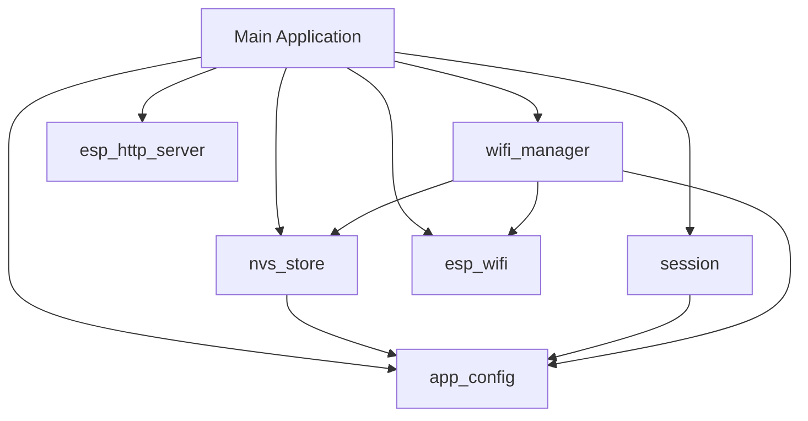

<!-- generated-by: gsd-doc-writer -->
# Architecture

## System Overview

The Fish Pump Relay Timer Control system is an ESP-IDF based firmware that provides dual-timer logic and relay control switching based on a binary float switch input. It utilizes a modular, layered architecture with low-level ESP-IDF components serving a centralized `main` application, exposing an embedded local web server for configuration without relying on external cloud dependencies.

## Component Diagram

## Data Flow

1. **Boot**: `main/app_main.c` executes. NVS is initialized, followed by the session store, Wi-Fi manager, and HTTP server.
2. **Setup Mode**: The device enters APSTA mode. A SoftAP (192.168.4.1) hosts the setup interface, and mDNS/captive DNS are launched for discovery.
3. **User Interaction**: Users access the UI to save STA credentials or timer configuration. Changes to STA trigger the Wi-Fi event handler to attempt connection.
4. **Main Loop**: The main task monitors the task watchdog, periodically retries HTTP server startup, and logs system state, while independent FreeRTOS tasks handle web server requests and captive DNS.

## Key Abstractions

- `app_config.h` (components/app_config): Header-only template configuration holding constants like default credentials and AP SSID.
- `nvs_store.h` (components/nvs_store): Persistent storage wrapper abstracting raw NVS keys for Wi-Fi credentials.
- `session.h` (components/session): In-memory volatile login token lifecycle management.
- `wifi_manager.h` (components/wifi_manager): State machine for Wi-Fi mode transitions, AP/STA configuration, and scanning.
- `web_server.h` (main): HTTP routing, middleware auth checks, JSON payloads, and embedded static serving.

## Directory Structure Rationale

- `components/`: Contains reusable, low-level modules with clean boundaries and declared ESP-IDF dependencies (`REQUIRES`).
- `main/`: Contains project-specific execution logic (app entrypoint, web server, and frontend static assets). `web_server` is located here to reference `EMBED_FILES` symbols generated from static frontend files.
- `scripts/`: Holds PowerShell scripts used for local Windows build automation and environment bootstrapping.
